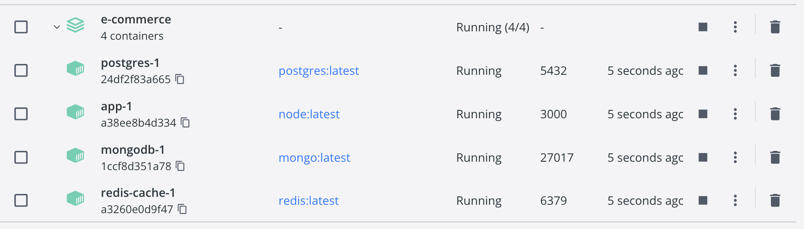
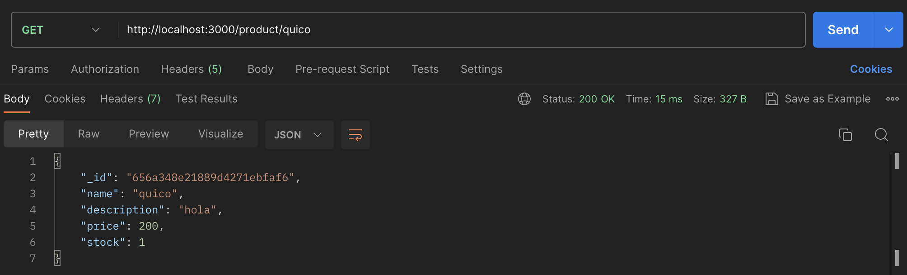
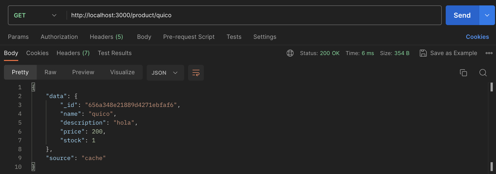

# e-commerce
e-commerce template

Prototipo para la asignatura de Arquitectura de Datos, para ver si es viable implementar una caché para una aplicación basada en microservicios desplegada en la nube con contenedores y aplicando prácticas continuas.

Tras haber insertado un producto aleatorio, la primera consulta se puede ver como recuperamos el dato.

Tras la segunda consulta vemos que la fuente de donde hemos recogido el dato es de caché. Tenemos que tenerlo en cuenta a la hora de tratarlo, así como asegurarnos que existe una coherencia entre BBDD principal y el sistema de caché.
